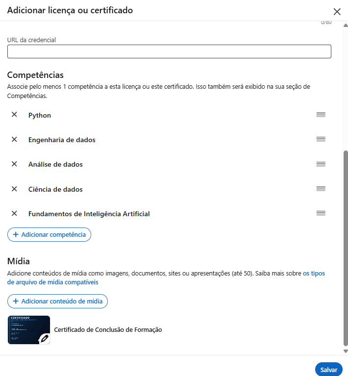

# Parabéns por chegar até aqui!

Você percorreu os seis blocos da formação Do Zero à Análise de Dados Econômicos e Financeiros usando a Linguagem R: 18 cursos, 392 aulas. Saiu de um ponto de partida que talvez fosse nunca ter escrito uma linha de código e construiu uma base completa em R aplicado a economia e finanças.

O caminho, em resumo:

- **Bloco 1** — pensar como analista, SQL e programação em R
- **Bloco 2** — coleta de dados das principais bases do país e do mundo
- **Bloco 3** — estatística, econometria e modelagem
- **Bloco 4** — relatórios e dashboards automatizados
- **Bloco 5** — séries temporais, machine learning, macroeconometria, mercado financeiro e políticas públicas
- **Bloco 6** — portfólio com o Clube AM

## O que ainda vale a pena aprofundar

A base está pronta. Caminhos naturais para seguir:

- **Aprofundamento em IA aplicada**, incorporando LLMs e automações mais sofisticadas ao seu fluxo de trabalho em R.
- **Python como segunda linguagem**, para ampliar seu repertório e transitar entre os dois ecossistemas mais usados em análise de dados.
- **Engenharia de dados**, construindo pipelines mais robustos e trabalhando com volumes maiores.
- **Domínios setoriais específicos**, verticalizando naquilo que mais despertou seu interesse ao longo da trilha.

Continue praticando com dados reais e aplique o que aprendeu no seu trabalho desde já.

# Onde você pode atuar com essa formação

Os cargos que listamos nas boas-vindas, agora com o que da trilha sustenta cada um:

- **Analista de Dados (economia e finanças)** — o ciclo completo (Bloco 1) com coleta, tratamento e apresentação em R (Blocos 2 e 4).
- **Cientista de Dados** — estatística e modelagem (Bloco 3) com Modelos Preditivos de Machine Learning (Bloco 5): construir modelos, avaliar erros e iterar até a previsão confiável.
- **Engenheiro(a) de Machine Learning** — machine learning (Bloco 5) somado à automação de pipelines com GitHub Actions (Bloco 4), que é o que leva um modelo do notebook para produção.
- **Economista com foco em modelagem** — estatística, econometria e séries temporais (Blocos 3 e 5): construir um modelo, interpretar resultados e avaliar erros.
- **Analista de Research** — coleta automatizada (Bloco 2), modelagem (Bloco 3) e relatórios recorrentes (Bloco 4), sem refazer tudo à mão a cada rodada.
- **Analista de Risco e de Investimentos** — Mercado Financeiro, Econometria Financeira e Demonstrativos Financeiros (Bloco 5) para precificação, risco e avaliação de ativos.
- **Pesquisador(a) acadêmico(a) aplicado(a)** — Dados em Painel, Políticas Públicas e Macroeconometria (Bloco 5), o instrumental da pesquisa empírica.
- **Consultor(a) quantitativo(a)** — a combinação dos seis blocos é a caixa de ferramentas de quem presta consultoria analítica.

# Seus certificados

Esta formação emite **dois tipos de certificado**, obtidos em lugares diferentes.

## Certificado de cada curso

Conforme você finaliza cada curso da trilha, o certificado individual correspondente fica disponível **na própria página daquele curso**, dentro da plataforma. São eles que comprovam cada etapa percorrida.

## Certificado da formação

Este é o certificado consolidado da trilha inteira, e ele **não fica na página de nenhum curso**. É emitido em um endereço próprio, a página de grupo da formação:

::: {.callout-important}
## Onde acessar o certificado da formação

🔗 **[Acessar a página da formação e gerar meu certificado](https://aluno.analisemacro.com.br/grupos/do-zero-a-analise-de-dados-economicos-e-financeiros-usando-a-linguagem-r/){target="_blank"}**

Guarde este endereço. É nele — e somente nele — que o certificado da formação completa é emitido. Procurar pelo certificado da formação dentro da página de um curso não vai funcionar, porque são coisas distintas.

O link abre em uma nova aba, para você não perder esta página.
:::

::: {.callout-warning}
## Para liberar o certificado da formação, conclua tudo

O certificado da formação só é gerado quando **todos os cursos da trilha estiverem concluídos** — e um curso só conta como concluído quando **todas as suas aulas e seções estão marcadas como concluídas** na plataforma.

Não basta assistir ao conteúdo: a marcação é o que registra sua progressão no sistema. Se faltar uma única aula ou seção sem marcar, em qualquer curso da trilha, a formação continua constando como incompleta e o certificado consolidado não fica disponível.

Antes de clicar no link acima, **marque esta aula como concluída** no botão da plataforma, logo abaixo desta página, e confira se não ficou nenhuma pendência nos cursos anteriores.
:::

# Seus próximos passos

1. **Marque como concluídos esta aula e todos os cursos da trilha** — todas as aulas e seções de cada um. Sem isso, o certificado da formação não é emitido, mesmo que você já tenha assistido a tudo.
2. **Acesse a página de grupo da formação** ([link acima](https://aluno.analisemacro.com.br/grupos/do-zero-a-analise-de-dados-economicos-e-financeiros-usando-a-linguagem-r/){target="_blank"}) e gere o seu certificado consolidado.
3. **Compartilhe sua conquista.** Veja como logo abaixo — é uma forma simples de mostrar ao mercado (e à sua rede) o que você construiu.
4. **Agende uma conversa com o Vitor Wilher.** Se você quer discutir carreira, tirar dúvidas sobre os próximos passos ou entender como aplicar o que aprendeu na sua situação específica, marque um horário:

   🔗 **[https://calendly.com/analisemacro/reuniao](https://calendly.com/analisemacro/reuniao){target="_blank"}**

5. **Continue evoluindo.** Explore as demais formações e cursos de especialização da Análise Macro para aprofundar exatamente a área que mais despertou seu interesse ao longo da trilha.

# Compartilhe seu certificado no LinkedIn

Um certificado guardado não abre portas. Um certificado **visível** no seu perfil mostra a quem procura talento que você não só estudou — você concluiu uma trilha inteira. Depois de emitido, o passo mais importante é salvá-lo no seu LinkedIn.

## Como adicionar o certificado no LinkedIn — passo a passo

**1. Abra a seção de licenças e certificados.** No seu perfil do LinkedIn, vá até **"Licenças e certificados"** e clique no **+** para adicionar um novo. Preencha:

- **Nome:** o nome da formação.
- **Organização emissora:** *Análise Macro*.
- **Data de emissão:** o mês e o ano em que você concluiu.
- **Código** e **URL da credencial:** pode deixar em branco — nosso sistema não gera um link de verificação externo.

{fig-alt="Formulário do LinkedIn 'Adicionar licença ou certificado' com Nome, Organização emissora e Data de emissão preenchidos" width="560"}

**2. Associe competências e anexe o certificado.** Ainda no formulário, role para baixo:

- Em **Competências**, adicione as habilidades que você desenvolveu na trilha. Elas também aparecem na sua seção de Competências, o que ajuda recrutadores a te encontrarem.
- Em **Mídia**, clique em **Adicionar conteúdo de mídia** e **anexe o arquivo do certificado** (o PDF que você baixou). É isso que deixa o certificado visível e clicável no perfil.

{fig-alt="Parte inferior do formulário do LinkedIn com as competências associadas e o certificado anexado em Mídia, com o botão Salvar" width="560"}

**3. Salve e confira o resultado.** Clique em **Salvar**. O certificado passa a aparecer no seu perfil, com a imagem, as competências e a data.

{fig-alt="Seção 'Licenças e certificados' do perfil do LinkedIn exibindo o certificado, com competências e o arquivo anexado" width="560"}

## Publique também no feed

Além de adicionar ao perfil, faça um post contando o que você aprendeu, os blocos que percorreu e o que pretende fazer com esse conhecimento. Marque a **Análise Macro** para ampliar o alcance, e use uma imagem — posts com imagem engajam mais.

::: {.callout-tip}
## Vale fazer os dois

Publicar no feed dá visibilidade imediata na sua rede, mas o post some no fluxo depois de alguns dias. Adicionar na aba de certificações deixa a conquista permanente no seu perfil, visível para quem visitar seu LinkedIn meses depois.
:::

# Obrigado por confiar na Análise Macro

Foi um prazer acompanhar sua jornada até aqui. Você investiu tempo real em construir uma base sólida em análise de dados econômicos e financeiros, e esse é o tipo de investimento que se paga ao longo de toda uma carreira. Estamos por perto para o que vier a seguir — conte com a gente.
