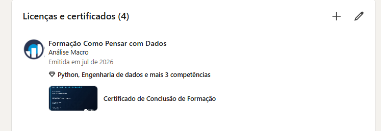

# Parabéns por chegar até aqui!

Se você está lendo esta página, é porque percorreu os seis blocos da Formação Analista de Pesquisa Quantitativa — e isso é uma conquista e tanto. Você saiu de um ponto de partida e construiu, aula após aula, projeto após projeto, o domínio de três linguagens completas — Python, R e SQL — integradas a estatística, econometria, séries temporais, machine learning e IA generativa. Poucas trilhas de formação em dados são tão amplas quanto essa, e isso é resultado de disciplina e prática real.

Vale reconhecer o caminho: você se **integrou à plataforma** (Bloco 1), construiu a **base de programação e análise de dados** em três linguagens (Bloco 2), dominou **estatística e econometria aplicada** (Bloco 3), avançou para **modelagem e previsão** (Bloco 4), aprendeu a aplicar **Inteligência Artificial** à pesquisa quantitativa (Bloco 5), e fechou tudo isso construindo o seu **portfólio de Data Science** (Bloco 6).

## O que ainda vale a pena aprofundar

A formação te deu uma base ampla e rigorosa — mas ela é só o começo da sua trajetória como pesquisador(a) quantitativo(a). Alguns caminhos naturais para continuar evoluindo:

- **Especializações setoriais** (mercado financeiro, macroeconomia, demonstrativos financeiros), para aplicar tudo o que você aprendeu num domínio específico.
- **Engenharia de dados**, para levar seus pipelines de pesquisa a um nível de produção mais robusto.
- **Visualização e comunicação de dados**, para apresentar resultados complexos de forma cada vez mais clara.
- **Aprofundamento em IA aplicada**, incorporando LLMs e agentes mais sofisticados ao seu fluxo de pesquisa.

Continue praticando com dados reais, revisitando os projetos dos seis blocos sempre que quiser refrescar um conceito, e aproveitando o Clube AM para se manter atualizado com novos códigos e aplicações.

# Onde você pode atuar com essa formação

Lá na página de boas-vindas, listamos os cargos e áreas que essa formação te prepara para buscar. Agora que você concluiu a trilha, veja o que aprendeu em cada bloco se traduz, na prática, para cada uma dessas posições:

**Analista de Pesquisa Quantitativa** — A combinação de estatística, econometria (Bloco 3) e modelagem em três linguagens (Blocos 2 e 4) é exatamente o perfil buscado para conduzir pesquisas quantitativas do início ao fim, da hipótese à evidência.

**Analista/Cientista de Dados** — Python, R e SQL dominados lado a lado (Bloco 2), somados a machine learning e IA (Bloco 5), formam a base técnica completa que esse cargo exige — independente da linguagem que a empresa usar.

**Economista com foco em modelagem e previsão** — Os blocos de modelagem e séries temporais (Bloco 4) te dão as ferramentas para transformar teoria econômica em previsões quantitativas defensáveis.

**Analista de Research (mercado financeiro ou consultorias)** — A trilha inteira — da coleta de dados à comunicação de resultados — espelha o dia a dia de quem produz research: hipótese, modelo, evidência, relatório.

**Pesquisador(a) acadêmico(a) aplicado(a)** — A profundidade metodológica de estatística e econometria (Bloco 3), somada ao rigor de conduzir uma pesquisa do zero, é diretamente aplicável a projetos acadêmicos e científicos.

**Consultor(a) quantitativo(a)** — Dominar três linguagens e o ciclo completo de pesquisa (Blocos 1 a 6) te credencia a atender projetos variados, adaptando a ferramenta certa a cada cliente.

# Seus certificados

Esta formação emite **dois tipos de certificado**, e eles são obtidos em lugares diferentes. Vale entender a diferença antes de seguir:

| | Certificado do curso | Certificado da formação |
|---|---|---|
| **O que cobre** | Um curso isolado da trilha | A trilha completa |
| **Quantos** | Um para cada curso concluído | Um único, consolidado |
| **Onde emitir** | Na própria página do curso | Na página de grupo da formação |
| **Requisito** | Todas as aulas e seções daquele curso marcadas como concluídas | **Todos os cursos da formação** concluídos |

## Certificado de cada curso

Conforme você finaliza cada curso da trilha, o certificado individual correspondente fica disponível **na própria página daquele curso**, dentro da plataforma. São eles que comprovam cada etapa percorrida.

## Certificado da formação

Este é o certificado consolidado da trilha inteira, e ele **não fica na página de nenhum curso**. É emitido em um endereço próprio, a página de grupo da formação:

::: {.callout-important}
## Onde acessar o certificado da formação

🔗 **[Acessar a página da formação e gerar meu certificado](https://aluno.analisemacro.com.br/grupos/formacao-analista-de-pesquisa-quantitativa/){target="_blank"}**

Guarde este endereço. É nele — e somente nele — que o certificado da formação completa é emitido. Procurar pelo certificado da formação dentro da página de um curso não vai funcionar, porque são coisas distintas.

O link abre em uma nova aba, para você não perder esta página.
:::

::: {.callout-warning}
## Para liberar o certificado da formação, conclua tudo

O certificado da formação só é gerado quando **todos os cursos da trilha estiverem concluídos** — e um curso só conta como concluído quando **todas as suas aulas e seções estão marcadas como concluídas** na plataforma.

Não basta assistir ao conteúdo: a marcação é o que registra sua progressão no sistema. Se faltar uma única aula ou seção sem marcar, em qualquer curso da trilha, a formação continua constando como incompleta e o certificado consolidado não fica disponível.

Antes de clicar no link acima, **marque esta aula como concluída** no botão da plataforma, logo abaixo desta página, e confira se não ficou nenhuma pendência nos cursos anteriores.
:::

# Seus próximos passos

1. **Marque como concluídos esta aula e todos os cursos da trilha** — todas as aulas e seções de cada um. Sem isso, o certificado da formação não é emitido, mesmo que você já tenha assistido a tudo.
2. **Acesse a página de grupo da formação** ([link acima](https://aluno.analisemacro.com.br/grupos/formacao-analista-de-pesquisa-quantitativa/){target="_blank"}) e gere o seu certificado consolidado.
3. **Compartilhe sua conquista.** Veja como logo abaixo — é uma forma simples de mostrar ao mercado (e à sua rede) o que você construiu.
4. **Agende uma conversa com o Vitor Wilher.** Se você quer discutir carreira, tirar dúvidas sobre os próximos passos ou entender como aplicar o que aprendeu na sua situação específica, marque um horário:

   🔗 **[https://calendly.com/analisemacro/reuniao](https://calendly.com/analisemacro/reuniao){target="_blank"}**

5. **Continue evoluindo.** Explore as demais formações e cursos de especialização da Análise Macro para aprofundar exatamente a área que mais despertou seu interesse ao longo da trilha, e mantenha o Clube AM como sua referência de códigos.

# Compartilhe seu certificado no LinkedIn

Um certificado guardado não abre portas. Um certificado **visível** no seu perfil mostra a quem procura talento que você não só estudou — você concluiu uma trilha inteira. Depois de emitido, o passo mais importante é salvá-lo no seu LinkedIn.

## Como adicionar o certificado no LinkedIn — passo a passo

**1. Abra a seção de licenças e certificados.** No seu perfil do LinkedIn, vá até **"Licenças e certificados"** e clique no **+** para adicionar um novo. Preencha:

- **Nome:** o nome da formação.
- **Organização emissora:** *Análise Macro*.
- **Data de emissão:** o mês e o ano em que você concluiu.
- **Código** e **URL da credencial:** pode deixar em branco — nosso sistema não gera um link de verificação externo.

{fig-alt="Formulário do LinkedIn 'Adicionar licença ou certificado' com Nome, Organização emissora e Data de emissão preenchidos" width="560"}

**2. Associe competências e anexe o certificado.** Ainda no formulário, role para baixo:

- Em **Competências**, adicione as habilidades que você desenvolveu na trilha. Elas também aparecem na sua seção de Competências, o que ajuda recrutadores a te encontrarem.
- Em **Mídia**, clique em **Adicionar conteúdo de mídia** e **anexe o arquivo do certificado** (o PDF que você baixou). É isso que deixa o certificado visível e clicável no perfil.

{fig-alt="Parte inferior do formulário do LinkedIn com as competências associadas e o certificado anexado em Mídia, com o botão Salvar" width="560"}

**3. Salve e confira o resultado.** Clique em **Salvar**. O certificado passa a aparecer no seu perfil, com a imagem, as competências e a data.

{fig-alt="Seção 'Licenças e certificados' do perfil do LinkedIn exibindo o certificado, com competências e o arquivo anexado" width="560"}

## Publique também no feed

Além de adicionar ao perfil, faça um post contando o que você aprendeu, os blocos que percorreu e o que pretende fazer com esse conhecimento. Marque a **Análise Macro** para ampliar o alcance, e use uma imagem — posts com imagem engajam mais.

::: {.callout-tip}
## Vale fazer os dois

Publicar no feed dá visibilidade imediata na sua rede, mas o post some no fluxo depois de alguns dias. Adicionar na aba de certificações deixa a conquista permanente no seu perfil, visível para quem visitar seu LinkedIn meses depois.
:::

# Obrigado por confiar na Análise Macro

Foi um prazer acompanhar sua jornada até aqui. Você investiu tempo real em construir uma base ampla e rigorosa como pesquisador(a) quantitativo(a), e esse é o tipo de investimento que se paga ao longo de toda uma carreira. Estamos por perto para o que vier a seguir — conte com a gente.
